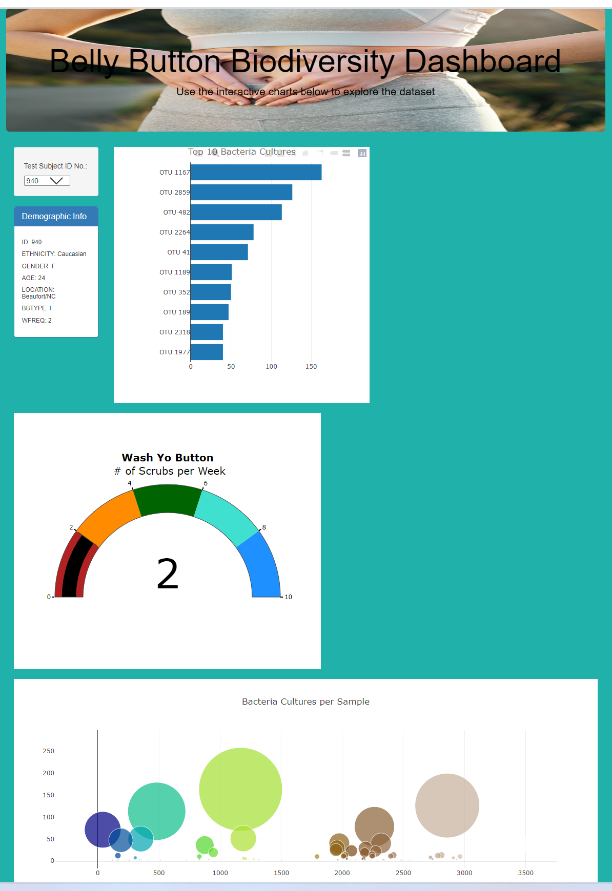
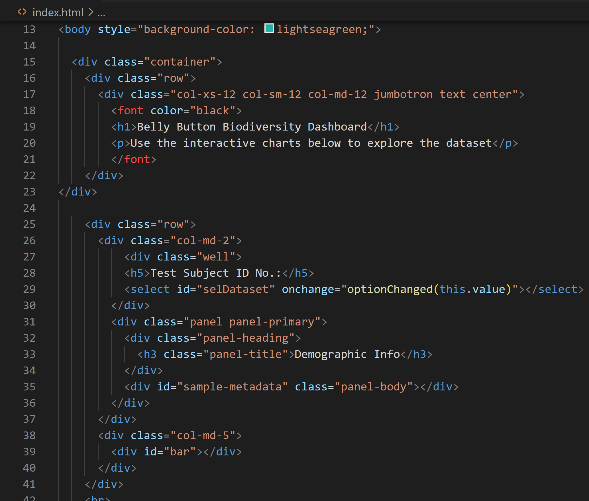
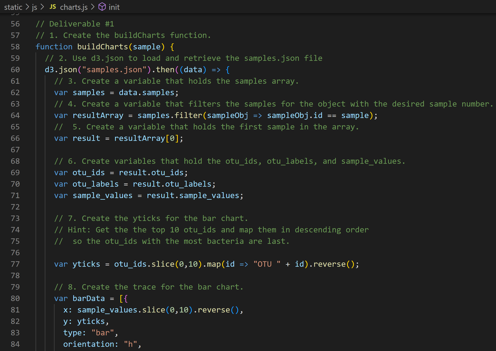

# Deployed to https://cagurr.github.io/plotlydiploy

# plotlydiploy

## Overview of the Belly Button Bacteria (BBB) Analysis

We helped Rosa, a decorated microbiologist researcher, study bacteria that can sythesize protein that tastes like beef.  Rosa would like to discover a bacteria that will be the next hottest non-meat product.  Rosa has partnered with Impossible Beef to derive that winning solution.  

Rosa and Impossoble Beef suspect that the sought after bacteria can be found in human belly buttons. To test their theory, Rosa sampled the bacteria from a large population of navels.  We will help her build a dashboard to display the results anonymously.    
 
### Resources

* Data Source:  sample.json, index.html, charts.js
* Software:  Visual Studio Code, 1.38.1, Chrome
* Packages:  None

## BBB Analysis Results

BBB Website:

## BBB Analysis Code Snippets

index.html:

charts.js:

